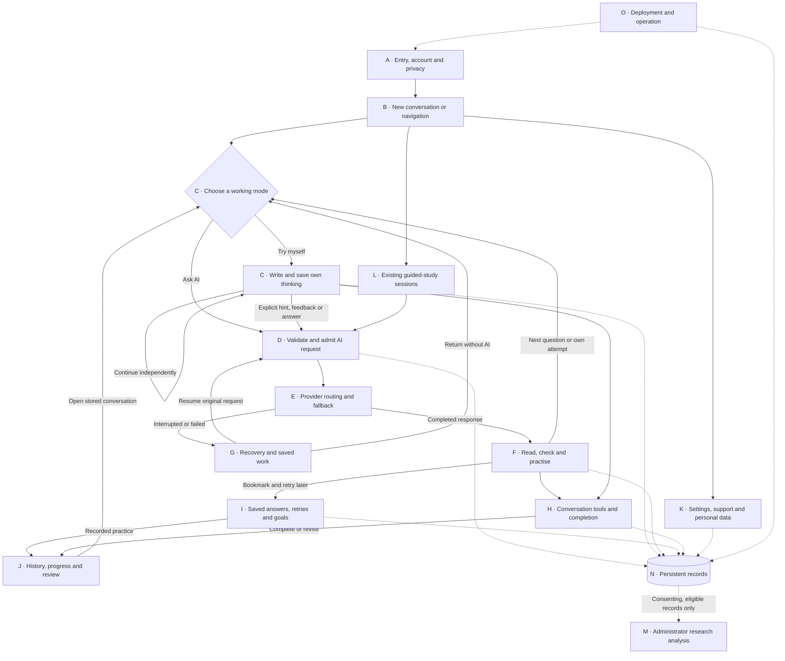

# ThinkFirst AI — Complete Application Workflow

**Purpose:** A standalone, detailed description of ThinkFirst for generating a connected system-workflow image. This describes how the application operates, from entry to saved work, AI assistance, independent practice, analysis and administration. It is not the project-development timeline or a generic description of how AI thinks.

**Basis:** Repository implementation reviewed on 23 September 2026. “Implemented” describes code present in this workspace; it does not mean production deployment, live account validation or a research study has been completed. Runtime configuration can change limits and available providers.

**Main idea:** A person can ask AI directly or try independently, switch between those choices, request limited help, record checks, revisit saved answers and see their recorded activity. Personal use does not require research participation. The application records observable actions; it cannot observe unexpressed thinking or establish learning merely from clicks.

## 1. How to read and draw this workflow

### Actors and lanes

| Lane | Responsibility |
| --- | --- |
| Person | Enters questions, chooses a mode, writes attempts, requests help, checks answers and controls personal data. |
| Website | Next.js interface, Clerk account components, drafts, rendering, navigation and request recovery. |
| API | FastAPI authentication, ownership checks, workflow rules, question association, request admission and orchestration. |
| AI routing | Chooses configured services, maintains context across fallback, manages provider attempts and cancellation. |
| External AI service | Generates a proposed response from the supplied context. It can fail or return an incorrect response. |
| Database | Stores identities, conversations, events, preferences, usage, reports and requests. |
| Research administrator | Runs permitted, consent-filtered exports and interprets limited behavioral statistics. |
| Operator | Configures hosting and credentials, performs migrations, handles deletion and operates backups. |

### Diagram notation

- Rounded rectangle: entry, return point or end state.
- Rectangle: action or processing step.
- Diamond: a decision, with named outgoing branches.
- Cylinder: persistent database or account-scoped browser storage. Distinguish the two.
- Solid arrow: control moves to the next step.
- Dashed arrow: read/write, external dependency or optional interaction.
- Loop arrow: retry, revision, next message or return to existing work.
- Orange border: recoverable interruption or user-reported issue.
- Gray dashed border: deployment dependency or future work; never show it as an active feature.

Every detailed node has a unique ID. A destination such as `D01` means the node with that ID, even when it appears in another panel. “Caller” means the screen or action that opened a shared subflow; draw a return connector rather than duplicating the entire subflow.

All decision branches below must be labeled. Optional actions must look optional. Do not connect every delivered answer to a compulsory attempt, verification or review.

## 2. Master map

**Entry and account → Privacy acknowledgment → New or existing conversation → Ask AI OR Try myself → Optional help → Saved response or saved thinking → Optional checking and practice → Continue or complete → History and progress.**

Settings, support, recovery and personal data controls are available alongside this cycle. Research export is a separate, administrator-only, consent-filtered branch.

The master map is a navigation overview. Detailed guards still apply: opening a completed conversation permits reading and eligible follow-up records, but does not reopen its AI composer; recovering an admitted AI request does not admit or charge a second request.

## 3. Panel A — Entry, authentication and privacy

| ID | Short image label | Detailed action and consequence | Next connection |
| --- | --- | --- | --- |
| A01 | Open ThinkFirst | The website loads its application shell. Public help, privacy and account pages are accessible without entering a private workspace. | Workspace → A02; public information → A09. |
| A02 | Account configured? | The website checks whether Clerk is configured. Shared development identity is a local development facility, not a production account system. | Clerk configured → A03; permitted local development → A05; invalid hosted configuration → A08. |
| A03 | Signed in? | Clerk supplies account state. Signed-out visitors see sign-in and create-account routes with a return destination. | Signed in → A05; signed out → A04. |
| A04 | Sign in or create account | Clerk handles credentials and the authentication methods enabled by the operator. ThinkFirst does not add a second password database. | Successful authentication → A05; validation/cancellation → remain A04. |
| A05 | Connect private workspace | Website obtains the account token and calls `GET /me`. API validates identity and finds or creates the associated application user. Browser storage is scoped to that account. | Valid identity → A06; expired login → A04; connection/configuration failure → A08. |
| A06 | Work permitted? | API returns privacy and account state. A pending account-deletion request restricts new work. A configured Clerk website must not silently use the shared API development identity. | Pending deletion → K08; inconsistent identity → A08; otherwise → A07. |
| A07 | Acknowledge privacy notice | Hosted users acknowledge the notice before ordinary writes. Research participation is a separate, optional choice, initially off. Local development has its explicit development behavior. | Acknowledged/already acknowledged → B01; acknowledgment fails → remain A07. |
| A08 | Recover connection | Show a safe error and retry or sign-in action. Retry connection and eligible queued work; do not fabricate an empty successful account. | Retry → A05; login required → A04; operator setup problem → O02. |
| A09 | Read public information | Help and privacy explain use and data handling; account pages connect to Clerk. Reading these pages makes no AI call. | Enter workspace → A02; leave → end. |

**Boundary:** API authentication and conversation ownership apply to subsequent requests, not just the first page visit. Research and operator endpoints also require administrator authorization. An unacknowledged notice blocks ordinary writes; personal privacy actions have their dedicated paths.

## 4. Panel B — Home, navigation and conversation creation

| ID | Short image label | Detailed action and consequence | Next connection |
| --- | --- | --- | --- |
| B01 | Choose destination | Shell offers New conversation, History, Progress, Saved and Settings, with supporting routes. Home remains the question-first screen. | New → B02; History/Progress → J01; Saved → I01; Settings → K01. |
| B02 | Enter a problem | Person types the opening question. It is required and limited to 20,000 characters. Select Ask AI or Try myself; Ask AI is the initial choice. | Valid submission → B03; missing/invalid text → remain B02. |
| B03 | Save conversation | Website submits `POST /sessions` with a stable event ID, chat experience and initial mode. API saves the conversation and `session_started` event. Repeated submission with the same identity is handled idempotently. | Saved → B04; connection failure → G01. |
| B04 | Open conversation | Navigate to `/session/[id]`. Fetch stored events, metadata, state and derived question activity. The original question establishes its question anchor. | Ask AI start → B05; Try myself start → C03; reopened conversation → C01. |
| B05 | Resume requested first answer | A stored pending intent represents the user's explicit Ask AI submission. It initiates the first answer with its original request ID. A normal page visit alone does not generate an answer. | Intent available → D01; intent could not be retained → manual answer action at C02. |

**Returning to work:** Loading history or a saved conversation reads existing data. It does not regenerate old answers, review the conversation automatically or consume an AI allowance.

## 5. Panel C — Ask AI and Try myself

| ID | Short image label | Detailed action and consequence | Next connection |
| --- | --- | --- | --- |
| C01 | Select working mode | The two modes remain separate and selectable. A mode change is recorded. Switching alone makes no AI call and does not require a saved attempt. | Ask AI → C02; Try myself → C03; completed conversation → H08. |
| C02 | Ask a question | Person types a follow-up, up to 5,000 characters, and sends it explicitly. Its request ID, answer length and language remain stable during recovery. An explicit typed follow-up establishes a recorded question turn. | Send → D01; switch mode → C03; leave draft → G01. |
| C03 | Write own thinking | Person writes a rough idea, first step or proposed answer, up to 20,000 characters. An account-scoped browser draft supports local recovery. Thinking need not be polished or correct. | Save → C04; request help → C05; switch → C02. |
| C04 | Save my thinking | Queue and save `attempt_submitted` with its question reference. A successful save clears the submitted draft. No provider is contacted. A late offline attempt retains its original question association. | Keep thinking → C03; help → C05; completion → H07. |
| C05 | Choose help | Available explicit help includes Get a hint, Check my thinking and Show an answer. Current draft is saved before dependent help is sent. A failed required save blocks that dependent request. | Draft needs saving → C04 then return; valid work → C06. |
| C06 | Select response purpose | Hint uses the current question and its matching attempt. Check my thinking requires a current-question saved attempt and asks for brief feedback and one next step. Show an answer requests an explanation. | Valid action → D01; missing attempt for feedback → C03. |
| C07 | Keep question context | API derives question anchors from the opening question, typed follow-ups and delivered related exercises. Help buttons retain the current anchor; regeneration retains the source anchor. Older attempts remain history, not current work. | Supplies D04 and F07; new question → C02. |

**Help depth:** Normal chat Get a hint uses partial assistance (tier 2), while direct answers and thinking feedback use tier 3 with different purposes. The three-level clarify/partial/full sequence is part of the separate guided protocol in Panel L. Do not depict normal chat as forcing that sequence.

**Thinking feedback boundary:** The prompt asks for feedback rather than a worked solution. This is neither certified grading nor a guarantee that a model can never reveal an answer.

**Question-tracking boundary:** An explicit follow-up is a recorded turn, not proof of a new semantic topic. Historical associations can be reconstructed without rewriting old events. Unknown or invalid question references are not silently reassigned.

## 6. Panel D — Shared AI request validation and admission

This panel is used by direct answers, hints, thinking feedback, related exercises and regeneration. Conversation review uses its own endpoint and event family but shares provider and budget infrastructure; see J05–J08.

| ID | Short image label | Detailed action and consequence | Next connection |
| --- | --- | --- | --- |
| D01 | Flush work and submit | Website flushes required queued events first and sends the AI action with a stable UUID. This makes the saved attempt available before model context is assembled. | Saved prerequisites → D02; save/network failure → G01. |
| D02 | Authenticate and validate | API verifies identity, ownership, privacy permission, conversation state, input bounds and action-specific requirements. Completed/deletion-restricted conversations cannot accept new chat generation. | Valid → D03; invalid → G05. |
| D03 | Request already known? | Compare the same request ID and immutable intent. A delivered request returns its stored answer; a pending one is recovered; an incompatible reuse is rejected. A final failed/cancelled request is not silently sent again. | New → D04; delivered → F01; pending → G03; final/error → G05. |
| D04 | Build bounded context | Resolve the active question and matching attempt, include bounded recent messages and preserved edit context where applicable, and attach purpose, help tier, style and language. | Context valid → D05; required context missing → C03 or G05. |
| D05 | Check allowance and concurrency | Check daily request, rolling-rate, per-user/global concurrency, shared token and optional estimated-dollar limits. A chat cannot have competing pending answer requests. | Capacity available → D06; rejected → G05, with own-thinking still available. |
| D06 | Reserve and record atomically | In a database transaction, reserve the permitted fallback envelope, persist the admitted request and prepare transient response state. Concurrent workers share the admission lock. | Admitted → E01; transaction failure → G05. |

### Context rules

- Normal answer context uses a bounded recent history, up to 12 messages and a 24,000-character history budget, alongside the relevant problem and attempt. Full stored history is not deleted when prompt context is shortened.
- The current attempt must belong to the active question. Earlier problem statements and attempts are labeled as background where included.
- Default concise output and explicitly selected detailed output use different output budgets. Pending requests retain the settings under which they were started.
- Language preference supports automatic, English, Hindi and Hinglish for newly generated content. It does not translate existing messages or the entire interface.
- Provider credentials, admin metadata and unrelated users' data are not placed in the user prompt.
- The app does not automatically browse the internet, retrieve external documents, inspect images or train a model on this conversation.

### Admission defaults, not promises of a free service

| Control | Code default |
| --- | --- |
| Accepted AI requests per user per UTC day | 30, including admitted requests that later fail. |
| Accepted requests per user in 60 seconds | 6. |
| Pending requests per user / workspace | 2 / 8; individual chat generation also has its own pending-request guard. |
| Shared daily accounted tokens | 1,000,000, including reservations and unknown usage. |
| Actual provider attempts per logical request | At most 3, additionally bounded by time and available providers. |
| Estimated-dollar cap | Off by default; requires an operator-supplied price ceiling when enabled. |

A positive “requests left” number does not guarantee that shared capacity or the current request's token reservation is available. Browser polling, retries of the same accepted identity and database reads are not new AI requests. An accepted request can cause several billable provider attempts; one user-visible request does not mean one provider charge.

## 7. Panel E — Provider routing, progressive answers and cancellation

| ID | Short image label | Detailed action and consequence | Next connection |
| --- | --- | --- | --- |
| E01 | Build provider order | Use the preferred/configured service, then configured fallback order without duplicates. Default fallback sequence is Groq, Gemini, OpenRouter, Mistral and Cloudflare. Optional legacy Claude support depends on configuration. | Ordered candidates → E02. |
| E02 | Eligible provider remains? | Skip missing configuration and services in cooldown. Skipped services consume no provider attempt. Enforce actual-call and total-time limits. Fallback can be disabled by configuration. | Eligible → E03; exhausted/disabled after failure → E09. |
| E03 | Send same request context | Server contacts the provider with its configured model, credentials and the same bounded question, attempt, purpose, language, style and help tier. Clear an earlier failed attempt's preview. | Response processing → E04; provider error → E05; Stop → E08. |
| E04 | Receive proposed response | Parse content and available usage. Supported tier-3 answer/feedback requests can update a transient preview. Hints and non-streamed purposes wait for their completed result. | Preview → E06 while pending; completed → E07; interrupted/invalid → E05. |
| E05 | Classify failure | A recoverable rate, availability, credential, model or invalid-response failure may place the service in cooldown and move to the next candidate. Refusal stops the chain instead of using fallback to bypass it. Unexpected terminal failures end the request. | Recoverable with fallback → E02; refusal/terminal → E09; cancellation → E08. |
| E06 | Show progressive preview | Browser polls server-owned draft state, approximately every 700 ms. It does not call the provider directly or open its own provider stream. Preview is provisional and is replaced if a provider switches. | More output → E04; Stop → E08; final result → E07; lost connection → G03. |
| E07 | Validate and save final answer | Reject missing, truncated or otherwise invalid output as implemented; hint-tier checks are heuristic, not proofs. On success, save the delivered event, question association, provider/model and usage, settle the reservation and remove preview state. | Saved final response → F01; rejected result → E05. |
| E08 | Stop generation | Persist a cancellation request and interrupt the active provider task. Clear provisional output and finish cancellation accounting. A response already completed before Stop remains completed. Cancellation does not guarantee the provider has charged nothing. | Cancelled → G05; already completed → F01. |
| E09 | Save failed outcome | Record the terminal failure, remove preview state and settle or conservatively retain usage. Keep the person's question and saved work. An explicit new attempt requires a new request ID. | Return with safe error → G05. |

### Fallback and accounting details

- Default provider timeout is 9 seconds and total routing budget is 50 seconds, subject to configuration bounds. Do not draw a promise that all five providers will always be tried.
- Configuration status means a key/model setting is present; it does not prove validity, remaining credit or live service availability.
- Cloudflare needs its account ID as well as its API credential. Keys stay on the server, not in the browser or workflow image.
- Fallback is automatic within an admitted request. It preserves context, but different providers can produce different wording and quality. Exhausted services still produce a visible, recoverable failure.
- Known usage is recorded. Unknown usage retains conservative accounting rather than becoming zero. Unused reservation is released when it can be safely reconciled.
- Interrupted workers retain their reservation for the admission day. Stale pending work expires after 90 seconds; it is not replayed as a fresh provider call.
- Provider-reported token and cost information is not the same as a complete provider invoice. An application estimate is not a hard provider billing cap.
- AI reasoning-token counts, when reported, are usage metadata. The app does not expose or store a model's private internal reasoning as a workflow step.

## 8. Panel F — Read, check, reflect and practise

All branches here are optional. A person may immediately continue chatting or return to their own work.

| ID | Short image label | Detailed action and consequence | Next connection |
| --- | --- | --- | --- |
| F01 | Read saved response | Render the final answer, hint, feedback or exercise. Supported Markdown, code, tables and math improve readability; unsafe HTML and remote image loading are restricted. | Next question → C02; own thinking → C03; optional tools → F02–F08; finish → H07. |
| F02 | Copy or rate usefulness | Copy answer/code locally, or save Helpful/Not helpful for the specific answer. Usefulness feedback is distinct from correctness and verification. | Return → F01; save failure → G04. |
| F03 | Record an answer check | Open optional Check this answer on a non-exercise response. Choose checked, found an issue or not checked. Checked/issue requires a method: calculation, example, source, reasoning or other. Add an optional note up to 2,000 characters. | Save → F04; cancel → F01. |
| F04 | Save verification report | Save an answer-linked, question-associated report. Revisions are recorded; latest report is displayed. Allowed after chat completion. No report means unreported, not “not checked.” | Saved → F07 and F01; save failure → G04. |
| F05 | Offer independent practice | A rule-based invitation can appear after repeated delivered AI answers without own thinking. It asks whether the person wants to try. It is not an AI-generated diagnosis. | Yes → F06; No → C02; preference off/ineligible → F01. |
| F06 | Accept or dismiss invitation | Yes records the decision and switches to Try myself, retaining existing draft work. No records dismissal and preserves Ask AI. A failed optional save should not disable ordinary chat. | Yes → C03; No → C02. |
| F07 | View thinking activity | Expand per-question recorded attempts, help requests, delivered replies and latest reported checks. Links return to the relevant question. Counts are derived without another model call. | Inspect message → F01 or C03; continue → C01. |
| F08 | Request related exercise | Explicitly request a similar standalone problem. Save required current draft first and use the exercise purpose. Success creates a new question anchor and selects Try myself. | Request → D01; delivered exercise → C03; failure → G05. |

**Practice invitation rules:** Eligibility includes a streak of three delivered answers without own thinking, maximum two recorded invitation decisions per conversation, a 10-minute cooldown and a further-answer threshold before a repeat. Saving own thinking or changing mode resets the relevant streak. Preferences can disable invitations. This is a gentle choice, not a mandatory lockout.

**Verification boundaries:** Reports are self-reported actions, not automatic fact-checking. Their notes are stored and exported with personal records; do not draw an automatic path sending them to an AI evaluator. Helpful feedback, chat verification reports and guided-study verification are three separate records.

**Exercise boundary:** The prompt asks for a problem without its answer, but model compliance is not guaranteed. There is no automatic certified grading of the person's later solution.

## 9. Panel G — Persistence, reconnect and failure recovery

| ID | Short image label | Detailed action and consequence | Next connection |
| --- | --- | --- | --- |
| G01 | Retain draft or pending action | Account-scoped browser storage retains supported drafts and queued essential events with their original IDs. Persistence depends on that browser/profile retaining its data. | Connection available → G02; otherwise → visible unsaved/pending state. |
| G02 | Flush events in order | Submit queued events sequentially per conversation. A required failed event stays queued and blocks dependent actions in that conversation without blocking unrelated conversations. | Saved → caller, including D01; failure → G01. |
| G03 | Recover original AI request | Read server status using the existing ID. Pending means wait/poll; delivered means load saved result. Bounded transport retries reuse the ID. A previously admitted request is not regenerated. | Pending → remain G03; delivered → F01; failed/cancelled → G05; unknown/not admitted → original submission under bounded recovery. |
| G04 | Retry optional record | Keep visible local feedback/error state and allow an explicit retry of the same optional save identity. Verification note recovery is not promised across closing the browser. | Saved → caller; declined/retry later → continue existing chat. |
| G05 | Show recoverable outcome | Explain the applicable problem: sign-in, validation, pending work, allowance, unconfigured AI, failed provider, cancellation or service error. Preserve existing saved work. Server errors can include a safe request reference. | Sign-in → A04; reconnect → A08; own work → C03; explicit new AI attempt → D01; support → K09. |

Client terminal-status recovery polls approximately every 1.5 seconds with a bounded wait; preview polling is a separate activity. Reopening a page does not guarantee a disconnected server job will finish. Server status determines the result.

Account changes switch storage namespaces and stop using the old account's request context. An erasure-completion marker clears corresponding local work. Browser drafts, server records, transient previews and downloaded exports are different data copies with different lifetimes.

## 10. Panel H — Conversation tools and completion

| ID | Short image label | Detailed action and consequence | Next connection |
| --- | --- | --- | --- |
| H01 | Find or rename | Search the loaded transcript with match navigation, or rename/reset a conversation title. Renaming changes metadata, not the recorded original question. Search makes no model call. | Return → F01 or C01. |
| H02 | Edit question safely | Edit an eligible original/typed question. Confirming Save edit and ask AI creates a new conversation with bounded earlier context and a source reference. The original conversation remains unchanged. | New conversation → D01; cancel → source conversation. |
| H03 | Regenerate latest answer | Allow regeneration only for the eligible latest delivery with no newer attempt/request. Preserve original intent, tier and question context. Use a new request ID and keep earlier answer versions. | Eligible → D01; ineligible → existing conversation with explanation. |
| H04 | Archive or restore | Change visibility metadata. Archive does not erase content or close/reopen a conversation. | History → J01; restore/open → C01. |
| H05 | Export conversation | Download readable Markdown with saved messages and supported practice/check records. Do not include unsent drafts or provisional provider previews. | Local file produced → same conversation. |
| H06 | Request conversation deletion | Require the explicit confirmation phrase. Save a pending deletion request, restrict new writes and retain read/export access while pending. Actual erasure is an operator action. | Pending → O05; other conversations → B01. |
| H07 | Complete conversation | Person explicitly completes. Flush required saves and require no pending answer. Derive the completion label from recorded AI requests/deliveries, not objective correctness. | Saved completion → H08; pending/save failure → G02/G03. |
| H08 | View completed work | Keep transcript and eligible feedback, verification, bookmarks, saved retries and review accessible. Do not accept new chat answer generation in a completed conversation. | New problem → B02; History/Progress → J01; bookmark → I01; review → J05. |

Completion labels mean:

- `solved_with_ai`: at least one AI answer was delivered before completion.
- `solved_without_ai_response`: AI was requested but no answer was delivered.
- `solved_independently`: no AI request was recorded before completion.

These labels express the application completion path and the person's choice to complete. They are not proof that a solution is correct or that no outside AI was used.

Ordinary navigation away from a chat leaves it open. The historical guided protocol has its own abandonment behavior; do not apply that behavior to everyday chat.

## 11. Panel I — Saved answers, deliberate retries and weekly goals

| ID | Short image label | Detailed action and consequence | Next connection |
| --- | --- | --- | --- |
| I01 | Save an answer | Bookmark an eligible delivered non-exercise answer, retaining the exact answer-version reference. Removing a bookmark hides it from Saved without rewriting its prior events. | Saved list → I02; return → F01. |
| I02 | Find saved work | Search question/answer text, filter unpractised work and paginate. Open the source conversation or choose to retry. | Source → C01/H08; retry → I03. |
| I03 | Try with answer hidden | `/practice/[id]` initially hides the earlier response and offers an own-attempt draft. Hiding is a learning aid, not secure exam protection. Person may also explicitly reveal without saving. | Save attempt → I04; reveal directly → I05. |
| I04 | Record retry | Save `learning_attempt_submitted` against the bookmarked answer. This is a later practice record, separate from the original conversation's first attempt. No AI call is made. | Compare → I05; further practice → I03. |
| I05 | Compare with earlier response | Show the old saved AI answer for comparison. It is not a verified answer key. Person can hide it and try again or revisit context. | Retry → I03; source → C01/H08; Progress → J02. |
| I06 | Set weekly practice goal | Store a target of 1–50 distinct saved answers retried, with an optional focus label. Pausing sets the target to zero without deleting practice. | Practice → I03; progress → I07. |
| I07 | Update weekly count | Count distinct saved-answer IDs/versions with retries since Monday 00:00 UTC. Repeating one answer does not repeatedly advance the distinct-answer target. | View progress → J02; choose next → I02. |

Bookmarking, searching, revealing, comparing, retrying and updating goals make no AI requests. Saved-answer retries can occur after conversation completion. Pending deletion restricts new records. Removing a bookmark preserves retry history; fulfillment of deletion of its source conversation removes the associated source/practice data. The optional goal focus text does not automatically classify or validate the topic practised.

## 12. Panel J — History, progress and explicit AI review

| ID | Short image label | Detailed action and consequence | Next connection |
| --- | --- | --- | --- |
| J01 | Search history | Read account-owned conversations with text/title search, status/archive/protocol filters and pagination. | Open → C01/H08/L01; Progress → J02. |
| J02 | Load recorded progress | API derives activity from effective records. Keep normal chat and guided study separate. Show applicable AI-first, time-before-AI, own-attempt and AI-answer trends. | Charts/tables → J03; goals → I06. |
| J03 | Interpret activity | Display exact values, available trends, saved retries and goal progress. Missing data stays missing. The guided protocol has its own verification measures. | Revisit work → J01/I02; new question → B02. |
| J04 | Open review section | Expanding the review area only loads its state. A review requires relevant saved conversation work and an explicit generation request. | Existing result → J08; generate → J05; insufficient work → continue C01. |
| J05 | Request conversation review | Submit an analysis request ID. Validate ownership, chat protocol, deletion state and review source content. Completed conversations can be reviewed. | Valid → J06; rejected → G05. |
| J06 | Reuse or generate? | Reuse the same request's result or an existing successful review for the unchanged source fingerprint. Changed work marks the older review stale; regeneration remains explicit. | Cached → J08; pending → J07; new eligible review → J07. |
| J07 | Generate bounded review | Build a bounded review context, admit against the shared usage system and route with purpose analysis. Use analysis-specific request/provider/delivery/failure events. Poll the analysis status endpoint for recovery. | Delivered → J08; failure → G05. |
| J08 | Read review with limits | Show the saved AI review and freshness state. Reading again does not spend allowance. It is a suggestion based on supplied excerpts, not a measurement of intelligence or proof of learning. | Return → F01/H08; changed work and explicit refresh → J05. |

Review context contains up to 24 recent selected text excerpts within a 16,000-character budget, plus a bounded opening question when needed. Truncation is tracked. It is not an unlimited copy of all account data. Optional answer-verification reports and saved-answer retries are not automatically included in the current review source/fingerprint.

**Keep three kinds of analysis separate in the diagram:** deterministic personal activity counts; explicitly requested AI conversation review; administrator research statistics. Only the AI review uses a model.

## 13. Panel K — Settings, privacy and support

| ID | Short image label | Detailed action and consequence | Next connection |
| --- | --- | --- | --- |
| K01 | Open Settings | Show account, answer/practice preferences, allowance, privacy/data and help/sync controls. Workspace administration is restricted to admin/development identities. | Select → K02–K10. |
| K02 | Manage account | Use configured Clerk account controls and sign-out. Account authentication remains Clerk's responsibility. | Signed out → A03; updated account → K01. |
| K03 | Save preferences | Store concise/detailed answer default, output language and practice-invitation preference. Existing answers and in-flight requests are not rewritten. | Next applicable generation → D04; return → K01. |
| K04 | View usage or resync | Read remaining allowance and reset time; privileged views include workspace totals. Retry account-scoped synchronization when needed. No billing probe or AI call is made. | Sync → G02; return → K01. |
| K05 | Choose research consent | Enable or withdraw optional research participation separately from the notice acknowledgment. Withdrawal excludes the account from future consent-filtered exports. | Save → K01; future eligible export → M02. |
| K06 | Export personal records | Download personal JSON containing supported account, conversation/event, preference, learning and report records. Does not include Clerk passwords or operator secrets. | Download complete → K01. |
| K07 | Request data deletion | Require the explicit account-level confirmation phrase. Record pending erasure and withdraw research consent. This is a request to erase conversation-related application data, not a claim to instantly delete the external Clerk identity. | Pending → K08. |
| K08 | Pending deletion state | Restrict new work, retain permitted read/export/cancellation paths, and show the pending status. Operator fulfillment is required. | Export → K06; processing → O05. |
| K09 | Report problem or suggestion | Submit category, 10–2,000-character message and optional safe error reference. Store an idempotent report and display its ID/status. No automatic transcript/log attachment or email is implied. | Saved/recent reports → K01; failure → G05. |
| K10 | Inspect workspace setup | Authorized users inspect configured AI availability, operator state, support reports and research access. Provider setup status is not a live-credit test. | Operator action → O02/O06; research → M01. |

Reports are limited to ten new reports per user in a rolling 24-hour period; replaying an existing report identity does not consume another slot. Users can see their recent reports. Administrators can view and mark reports open/resolved. A real support contact must be supplied by the operator.

Consent withdrawal cannot retract copies already exported outside the application. Personal downloads and backups require their own retention handling. Neither consent nor an AI-usefulness rating is permission to claim a research result that has not been established.

## 14. Panel L — Historical guided-study workflow

This is a distinct implemented experience for existing guided sessions and the guided protocol, not the default new-chat homepage flow. API requests that omit the experience can use the guided default; normal home creation explicitly selects chat.

| ID | Short image label | Detailed action and consequence | Next connection |
| --- | --- | --- | --- |
| L01 | Open guided problem | Load the guided session and its protocol-specific state. | Own work → L02. |
| L02 | Attempt or explicitly skip | Record an initial attempt or an explicit skip. Where applicable, record self-reported adequacy/correctness separately from any AI judgment. | Request help → L03; eligible independent completion → L06. |
| L03 | Choose eligible help tier | Follow the permitted clarify → partial → full progression. The person need not request every level before finishing. | Eligible AI request → D01; delivered → L04. |
| L04 | Verify or explicitly skip | Record the required protocol decision for the delivered hint/answer before moving to another eligible help step. A normal chat's missing optional report does not count as this skip. | Next tier → L03; finishing → L05; eligible full-answer follow-up → D01 then L04. |
| L05 | Evaluate or explicitly skip | Record the applicable final evaluation decision. New applicable deliveries can require a fresh decision. | Complete → L06. |
| L06 | Close guided session | Save the appropriate final session state and derive protocol-specific metrics. | History → J01; consenting research records → M02. |
| L07 | Leave unfinished | An explicit/in-app departure can record abandonment under guided behavior. Browser-close warning behavior preserves an open session rather than promising delivery of a closing event. | Saved abandonment → J01; continue → L01. |

Connect `L01–L05 → L07` for permitted unfinished departure, with pending-operation guards. Link the shared AI panel's return to `L04`, not normal chat `F01`, when the caller is guided. Keep guided events and personal optional chat checks distinct in both storage interpretation and graphics.

## 15. Panel M — Consent-filtered research analysis

| ID | Short image label | Detailed action and consequence | Next connection |
| --- | --- | --- | --- |
| M01 | Administrator requests analysis | Authorized administrator chooses date bounds, chat/guided experience and JSON/CSV output. Research access is not a general-user navigation permission. | Authorized → M02; unauthorized → reject. |
| M02 | Select consenting records | Read only records allowed by current research consent. Reconstruct effective timelines before date filtering; exclude invalidated events and sessions without valid starts. | Eligible records → M03; empty → M06 with empty/insufficient result. |
| M03 | Derive session measures | Derive applicable AI-first, timing, request-frequency, effort-proxy, verification, independent-completion and self-report measures. Missing evidence remains unknown where required. | Session measures → M04. |
| M04 | Aggregate participants | Aggregate eligible closed-session data to participant rows. Repeated conversations are not independent people. Keep protocol cohorts separate. | Participant frame → M05. |
| M05 | Check statistical sufficiency | Apply implemented sample/variation checks before each statistic. Report insufficient or unstable states rather than manufacturing results. | Sufficient → computed statistic; insufficient/unstable → explicit status; both → M06. |
| M06 | Export and interpret | Return participant CSV or statistical JSON and retain supported research-export records. Administrator interprets associations with the limits of consent, sampling and measurement. | Further explicit analysis → M01; finish → end. |

Implemented statistical checks include:

- Mann–Whitney comparison when both groups have at least two observations, with rank-biserial effect size.
- Spearman correlation with at least three paired observations and nonconstant data.
- Logistic regression with at least twenty participants, both outcome classes, a varying predictor and a stable finite converged fit.

These thresholds are implementation guards, not assurances of statistical power or research validity. Effort inferred from text length/time is a proxy; verification and adequacy can be self-reported. A request-frequency window is not a direct measure of dependence or ability. No causal conclusion follows merely from an association.

The newer question-turn activity metadata does not silently replace historical session-level research definitions. This implementation does not claim a new randomized study, validated confidence scale, learning-gain score or completed paper result. Research export and deterministic calculations make no AI calls.

## 16. Panel N — Data connections and ownership

### Persistent record groups

| Group | Actual tables / storage | Writers and readers |
| --- | --- | --- |
| Identity and privacy | `users`, `user_privacy` | A05/A07 establish state; K05/K07 change permission; every private API request checks applicable ownership/permission. |
| Preferences and goals | `user_preferences`, `answer_preferences`, `learning_preferences` | K03/I06 write; conversations, provider context and Progress read. |
| Conversations | `sessions`, `conversation_metadata`, `conversation_state` | B03 creates; modes, title/archive and completion update relevant state; history/session screens read. |
| Behavioral timeline | `events` | Attempts, AI lifecycle, checks, feedback, bookmarks, retries and protocol decisions append records. Effective-event readers exclude invalidated events. |
| Pending provider preview | `response_drafts` | AI execution writes provisional text/cancellation state; browser status polling reads; finalization removes the preview. |
| Usage control | `ai_budget_lock`, `ai_usage_requests` | Atomic admission and completion accounting; usage screens and limits read. |
| Support | `support_reports` | Users submit owned reports; authorized operators inspect and resolve. |
| Erasure | `deletion_requests`, `conversation_deletions` | User requests and operator fulfillment; guards and UI read pending/completed state. |
| Research outputs | `user_behavior_rollup`, `research_exports` | Analytics/rollup/export paths maintain derived records. The rollup is a persisted table, not a claim of a SQL materialized view. |
| Browser-only state | Account-scoped drafts, pending action/request identities and queues | Website writes and recovers supported local work; no cross-device or cleared-browser recovery guarantee. |
| User-controlled files | Downloaded Markdown/JSON/CSV | Export produces an external copy; later server deletion cannot automatically recall it. |

### Exact data-arrow rules

1. Person → website: question, attempt, choice, feedback or preference.
2. Website → API: authenticated, validated operation with an event/request identity where required.
3. API ↔ database: owner-scoped reads/writes; the browser does not connect directly to PostgreSQL.
4. API → AI routing → external provider: bounded prompt and server-side credentials, only for an explicit generation action.
5. Provider → API → database: proposed response and available usage; only a successful final response becomes a delivered answer.
6. Database → API → website: stored answer, status, history, activity or export; reading is not generation.
7. Browser queue → API: replay the original event identity, not a duplicate human action.
8. Consenting effective events → analytics → administrator export: a separate access path from personal use.
9. Pending erasure → operator → targeted database erasure → account-scoped client cleanup marker.

Events are ordinarily append-only. Corrections use invalidation events rather than quietly rewriting research history. Preferences, metadata, budgets and previews are mutable state, so do not label the entire database immutable. Server timestamps and event order show when actions were recorded, not the precise time a person began thinking offline.

## 17. Panel O — Deployment, operation and erasure fulfillment

| ID | Short image label | Detailed action and consequence | Next connection |
| --- | --- | --- | --- |
| O01 | Prepare deployment | Build website/API artifacts and prepare PostgreSQL, Clerk and host configuration. Existing repository handoff covers Netlify frontend and a separately hosted API/database. | Configure → O02. |
| O02 | Configure and migrate | Supply appropriate public/private keys, origins, HTTPS, provider models, usage limits, support details and admin identity. Run owner-level additive migrations and runtime grants separately from normal API permissions. | Valid setup → O03; invalid → correct O02. |
| O03 | Start and verify services | Start API and website; health and database/runtime checks surface readiness problems. Hosted account isolation and deliberate live-provider validation remain deployment checks, not assumptions from local code. | Ready → A01; unhealthy → O02/O06. |
| O04 | Back up and restore safely | Operator schedules and secures backups, defines retention and performs restore drills into a separate target. Existing tooling does not automatically configure all hosting schedules/storage policies. | Normal service → O03; incident → O06. |
| O05 | Fulfill exact erasure request | Operator uses the documented offline process, stops relevant API replicas and targets the exact request/account or conversation. Transactional deletion restores protections and rolls back on error. Resume service after fulfillment. | Completed marker → A05/G01 cleanup; failed → pending state K08/H06. |
| O06 | Handle operational issue | Inspect safe diagnostics/report references, correct configuration or service issues, resolve support reports and communicate through the configured support process. | Recovered → O03; data recovery → O04. |

Account-level erasure removes the covered application conversation data and related preferences/goals/reports under the implemented process while retaining necessary identity, usage and audit records. Individual-conversation erasure targets that source and associated records; edited copies are separate conversations. Neither flow promises immediate destruction of every external backup, download or third-party account.

Local checks and deployment preparation exist. A public production rollout, real hosted multi-account verification, managed backup schedules and a research pilot must be demonstrated separately. Do not label this panel “deployment completed” merely because the local application runs.

## 18. Functional page and API map

### Website pages

| Route | Workflow role |
| --- | --- |
| `/`, `/new` | Question entry and initial mode choice. |
| `/session/[id]` | Normal conversation or existing guided experience. |
| `/history` | Find, filter and revisit conversations. |
| `/dashboard` | Personal Progress, charts and practice activity. |
| `/saved` | Search saved answer versions and choose a retry. |
| `/practice/[id]` | Retry a saved answer, reveal and compare. |
| `/settings` | Account, preferences, usage, privacy and restricted administration. |
| `/support` | Submit and revisit support reports. |
| `/help`, `/privacy` | Public use/data information. |
| `/login/[[...login]]`, `/signup/[[...signup]]` | Clerk sign-in and account creation. |
| `/research` | Authorized research analysis interface. |
| Error / not-found views | Clear failures and navigation recovery. |

### API operation groups

| Purpose | Endpoints |
| --- | --- |
| Health, identity, setup | `GET /health`, `/service-info`, `/me`, `/operator/status`, `/ai/status`. |
| Privacy and export | `GET /privacy`, `POST /privacy`, `GET /privacy/export`, `POST /privacy/deletion`. |
| Create/read conversations | `POST /sessions`, `GET /sessions`, `GET /sessions/{id}`, `GET /history`. |
| Conversation changes | `POST /sessions/{id}/title`, `/archive`, `/deletion`, `/edit-question`, `/close`. |
| Behavioral writes | `POST /events`, including validated attempts, feedback, verification, bookmarks and retries. |
| AI generation/recovery | `POST /ai/hint`, `GET /ai/requests/{event_id}`, `POST /ai/requests/{event_id}/cancel`, `GET /ai/usage`. |
| Explicit AI review | `POST /sessions/{id}/analysis`, `GET /ai/analyses/{event_id}`. |
| Preferences | `GET/POST /preferences`, `/preferences/answers`, `/preferences/language`. |
| Learning and progress | `GET/POST /learning-goal`, `GET /saved`, `/saved/{answer_id}`, `/progress`, `/analytics/me`. |
| Support | `GET/POST /support/reports`, `GET /operator/reports`, `POST /operator/reports/{report_id}`. |
| Research | `GET /analytics/research`. |

The historic endpoint name `/ai/hint` serves multiple current chat purposes; do not infer that every request through it is a hint. Clerk handles its own authentication endpoints separately.

## 19. Which actions use AI?

| Action | New logical AI request? | Key distinction |
| --- | --- | --- |
| Ask AI / typed follow-up | Yes, when admitted. | Explicit generation. |
| Get a hint / Show an answer | Yes, when admitted. | Uses current question and matching saved work. |
| Check my thinking | Yes, when admitted. | Requires current-question attempt; feedback purpose. |
| Related exercise | Yes, when admitted. | Produces a practice question and changes focus on success. |
| Regenerate answer | Yes, when admitted. | New version; original is retained. |
| Save edit and ask AI | Yes, when admitted. | New conversation and new generation. |
| Generate/refresh conversation review | Yes, if not reused from cache. | Explicit analysis purpose, not per-message background review. |
| Fallback attempt | No additional logical request. | May create additional provider token/cost usage. |
| Stream-preview/status polling | No. | Reads the existing request state. |
| Reopen existing review or replay accepted request ID | No. | Reads/reuses stored state. |
| Save thinking, switch modes, record answer check | No. | Ordinary event writes. |
| Copy, rate usefulness, bookmark, retry, compare | No. | Local operation or stored record/read. |
| History, search, charts, goal, language preference | No. | Deterministic application functions. |
| Research statistics/export, support, privacy/export | No. | Database and analytics operations. |

If admission is rejected, no provider is called. Once admitted, failure/cancellation does not automatically restore the daily logical-request allowance or erase incurred/unknown usage.

## 20. Important complete paths to show in the image

### Path 1 — Independent completion

`A01 → A02 → A03/A04 → A05 → A06 → A07 → B01 → B02 [Try myself] → B03 → B04 → C03 → C04 → H07 → H08 → J02`

Result: the person saves their own work and completes without requesting AI. Records support progress, but the application does not certify the solution.

### Path 2 — Direct AI answer with optional verification

`B02 [Ask AI] → B03 → B04 → B05 → D01 → D02 → D03 [new] → D04 → D05 → D06 → E01 → E02 → E03 → E04 → E06 → E07 → F01 → F03 → F04 → C02 or H07`

Result: one admitted request, possibly several provider attempts, one final saved answer and an optional user-reported check. Verification makes no additional model call.

### Path 3 — Own attempt, limited help, revision

`C03 → C04 → C05 [Check my thinking] → C06 → D01–D06 → E01–E07 → F01 → C03 [revise] → C04 → H07`

Alternative: select a hint or answer at C05. The person keeps control; receiving help does not force an automatic full solution afterward.

### Path 4 — New topic without old-attempt confusion

`Phone question → saved AI answer → explicit “5 × 9” follow-up at C02 → new question anchor C07 → C03/C04 [45] → C05 [hint/feedback] → D04 [multiplication + matching attempt] → F01`

Result: the phone discussion is background. The current attempt is associated with multiplication. A repeated help button is not treated as a new phone question. This fixes context selection; it does not guarantee a correct model response.

### Path 5 — Provider failure and safe fallback

`D06 → E01 → E02 → E03 [provider A] → E05 [recoverable] → E02 → E03 [provider B, same context, fresh preview] → E07 → F01`

If no eligible service succeeds: `E02 → E09 → G05 → C03`. The person can continue saving their own work while AI is unavailable.

### Path 6 — Disconnect or Stop

Disconnect: `E06 → G01/G03 → server status [pending] → G03 → server status [delivered] → F01`.

Stop: `E06 → E08 → G05 → C01`. If final delivery won the race: `E08 → F01`. Neither path silently creates a replacement AI request.

### Path 7 — Save, revisit and practise

`F01 → I01 → I02 → I03 → I04 → I05 → I07 → J02 → I02`

Result: later practice with the old answer initially hidden, comparison on request and deterministic goal/activity updates, all without a model call.

### Path 8 — Explicit review and research separation

Personal review: `H08/F01 → J04 → J05 → J06 [uncached] → J07 → J08`; reopening: `J04 → J08`.

Research: `K05 [opt in] + eligible effective records → M01 → M02 → M03 → M04 → M05 → M06`.

These are different purposes, permissions and computations. Do not merge them into an automatic “AI analyzes everyone” box.

## 21. State and branch checklist

Use this checklist before approving an image made from the file:

- Entry shows public pages, signed-out, signed-in, permitted development and configuration-error branches.
- Privacy acknowledgment and research consent are separate decisions.
- New chat saves before the requested initial generation; mere page opening does not generate.
- Ask AI and Try myself are equally visible and can be switched without forced help.
- Own draft → saved attempt → dependent AI request is drawn in that order.
- Current-question association prevents an earlier topic's attempt from becoming current work.
- AI request replay, pending recovery and new explicit generation are different paths.
- Ownership/state checks precede budget reservation; reservation precedes provider calls.
- Provider fallback preserves context and replaces provisional output rather than concatenating answers.
- Refusal, exhausted providers, cancellation and successful completion have distinct outcomes.
- Preview is separate from a completed saved answer.
- Human verification is optional in chat; guided verification/skip is its separate protocol.
- Practice invitation includes both Yes and No and respects preferences/cooldown.
- Bookmarks, retries and weekly goals connect to Progress without an AI generation arrow.
- Editing creates a new conversation; regeneration creates a new answer version.
- Archive, completion and deletion are three different operations.
- Completed chat stays readable but cannot generate another ordinary chat answer.
- Review cache is visible; progress counts do not secretly call AI.
- Research selects consented effective records and separates protocols and participants.
- Erasure remains pending until the operator fulfills it; backups/downloads have separate lifetimes.
- Production/pilot dependencies and future features are outside implemented paths.

## 22. Outside the implemented workflow

Keep these in a small gray side note, not in the solid-arrow application flow:

- Production hosting activation, real hosted account isolation and deliberate live-provider verification depend on operator setup and checks.
- A research pilot, recruitment, study approval where applicable, measurement validation and a completed research report are not proven by having an analytics endpoint.
- Dedicated confidence-before-attempt collection, scheduled/spaced practice reminders, a reviewed problem bank and a new comparative-study protocol are possible later additions, not implemented claims here.
- File/image understanding, voice interaction, automatic web research, full interface translation, classroom/team workspaces, payments and leaderboards are not part of this documented implementation.
- No hidden mental-state tracking, automatic intelligence scoring, guaranteed prevention of AI dependence or guaranteed improvement in reasoning should appear in the image.

## 23. Copy-ready prompt for generating the workflow image

> Create a detailed, professional workflow diagram titled **“ThinkFirst AI — Complete Application Workflow”** with subtitle **“Independent thinking, optional AI assistance, saved practice and consent-based behavioral analysis.”**
>
> Use this entire document as the source of truth. Show the actual application's operation, not a development lifecycle, a generic chatbot or a diagram of a model's hidden reasoning. Do not invent features or imply unfinished deployment/research steps are complete.
>
> Create one large, zoomable landscape poster with a readable master map at the top and fifteen clearly separated detailed panels below: A Entry/account/privacy; B Home/conversation creation; C Ask AI/Try myself; D AI admission/context/limits; E Provider routing/preview/Stop; F Answer checking/practice; G Save/reconnect/recovery; H Conversation tools/completion; I Saved retries/goals; J History/progress/review; K Settings/privacy/support; L Guided-study protocol; M Research analysis; N Data connections; O Deployment/operation. Use a spacious grid, with C–F as the main central band. Preserve panel and node IDs.
>
> Distinguish the Person, Website, API, AI routing, External provider, Database, Research administrator and Operator with a lane legend or actor badges. Use blue for user actions, teal for own-thinking and practice, violet for AI processing, neutral gray for data, orange for recoverable interruptions, and a muted separate color for research. Also use labels/shapes so color is not the only distinction.
>
> Put a concise label in each box, normally three to seven words; use a short explanatory line only where needed. The detailed tables supply the semantics. Use rounded entry/end nodes, action rectangles, decision diamonds and database cylinders. Keep arrowheads unambiguous and lines orthogonal. Label every decision exit. Use matching numbered cross-panel connectors rather than long crossing lines. Dashed arrows mean data/dependency or optional interaction; solid arrows mean control flow. Draw return loops explicitly.
>
> The most prominent branch must be **Ask AI OR Try myself**. Both are valid and remain separate. Show own thinking → save → optional hint / thinking feedback / answer → revision. There must also be a path to completion without any AI request. Do not force an attempt before Ask AI, force verification after every answer, or force participation in research.
>
> Expand the AI pipeline: authenticate/authorize → replay or new-request decision → current-question and matching-attempt context → limits → atomic reservation → configured provider order → generation → transient preview → validated final save. Show recoverable provider failure looping to the next configured provider with the same context, replaced previews, bounded attempts, terminal refusal, exhausted fallback, Stop and reconnect using the original request ID. Browser preview/status polling is a read, not another AI generation.
>
> Show optional answer usefulness feedback, answer-verification reports, related exercises, the Yes/No practice invitation, per-question thinking activity, bookmarks, hidden-answer retries and weekly goals. Connect these to recorded progress while keeping AI conversation review, deterministic charts and consent-filtered research statistics separate.
>
> Show editing as a new conversation and regeneration as a new answer version. Archive, completion and pending deletion need different symbols/labels. Include owner-scoped persistence, browser drafts/queue, the support-report flow and operator erasure fulfillment. Guided-study verification/skip must be visibly separate from normal chat's optional checks.
>
> Include a compact cost legend: **explicit generation uses allowance; reads, saves, retries of saved exercises, checks and charts do not; provider fallback can incur additional provider cost within one logical request.** Include a compact truthfulness note: **activity is not ability; user checks are self-reported; AI responses require judgment; deployment and research findings are not established merely by implementation.**
>
> Use Section 20's eight complete paths to check continuity and Section 21 to check coverage. Preserve all meaningful branches, loops, actors and dependencies. You may group repetitive API endpoints into small operation callouts, but must not omit a functional branch. Do not put every explanatory paragraph inside the image. Never invent an arrow when the source specifies a guard or optional choice.
>
> Prioritize readable labels and correct connections over decoration. Export as a scalable diagram if the tool permits, otherwise use the highest practical resolution with enough space to zoom. If one rendered image cannot preserve legibility, retain one overall poster composition but provide separately readable A–O detail panels as companion images. Do not silently remove detail to fit a small canvas.

## 24. Repository references

This file stands alone for image generation. These references help maintain it when the implementation changes:

- [README](../README.md): application overview and local entry points.
- [How it works](how-it-works.md): existing user/application explanation.
- [AI usage](ai-usage.md): budgets, accounting, fallback and rendering boundaries.
- [Chat review](chat-review.md): question-context fixes and conversation tools; older setup status may predate later work.
- [Thinking support](thinking-support.md): current-question anchors, feedback and optional verification.
- [Saved learning](saved-learning.md) and [functional updates](functional-updates.md): retries, goals, language, exercises and reports.
- [Event schema](event-schema.md): behavioral events and protocol distinctions.
- [Operations](operations.md), [deployment checklist](deployment-checklist.md) and [validation](validation.md): operating procedures, pending hosting steps and recorded checks.
- `apps/web/components/SessionFlow.tsx`, `apps/web/lib/aiRequest.ts`, `apps/web/lib/eventClient.ts`: chat and recovery behavior.
- `apps/api/main.py`, `apps/api/question_tracking.py`, `apps/api/chat_context.py`, `apps/api/routing.py`: endpoint rules, context and provider orchestration.
- `analytics/`: consent-aware data preparation, statistical analysis and export tooling.

This documentation does not change application structure, credentials, recorded conversations or research definitions.
